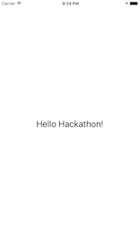

# Hackathon Aufgaben

Das erste Ziel ist, eine App zu erstellen, welche zählt, wie oft ich beim Beacon vorbeigekommen bin. 

Wichtig: Keine Frage ist zu blöd, stellt soviele ihr könnt!

## 1. Hello Word

Xcode starten, Projekt hinzufügen, Umgebung erklären. 

Main.storyboard öffnen, einen Label "Hello World" einfügen hinzufügen. 
Achtung: Constraints sind manchal mühsam, abhilfe via: 


"Run" im Simulator. 

iPhone anhängen, Run auf iPhone (Braucht Apple ID + Credentials)
_--> Frage:  Wer hat den Account ?_



## 2. Interaktion hinzufügen
Button "Count" hinzufügen
IBAction für Button erstellen
IBoutlet für Label erstellen
Variable "count" erstellen, +1 bei action.
Problem: beim laden ist der counter nicht 0. Lösung z.B. über funktion.

```swift
class ViewController: UIViewController {
    
    var count=0;
    
    @IBOutlet weak var counterLabel: UILabel!
    
    func updateCounter(){
        count=count+1
        counterLabel.text="#\(count) mal gedrückt!"
    }
    
    @IBAction func countButtonPressed(sender: AnyObject) {
        updateCounter()
    }
    override func viewDidLoad() {
        super.viewDidLoad()
        updateCounter()
    }

    override func didReceiveMemoryWarning() {
        super.didReceiveMemoryWarning()
    }
    
}

```


## 3. Interactor konfigurieren
Einloggen, Beacon hinzufügen. 
Zone, Event, jedes mal ein push "CONTER!!", Zone auf sehr klein setzen.
Batterie rausnehmen, da sonst das SDK kein Event triggert. 
_--> Account für alle vorbanden?_
_--> Beacon für alle vorhanden?_

## 4. SDK einfügen
Wichtig: Auf dem iPhone laufen lassen, sonst gibt es Fehler!

Schritte auf der [Webseite](https://developer.interactor.swisscom.ch/developer/sdk/swift/getting-started) durchführen.
Hinweis, ich verwende immer das Interactor.framework und setze other linker flags -lc++.
Wichtig: Interactor.framework unter General/Embedded Binaries hinzufügen.

Grundrauschen erscheint auf der Konsole.

## 5. Counter anpassen

Verbinden des Appdelegates mit dem ViewController mittels: 

```swift
func eventTriggered(data: LBSEvent!) {
    self.notify(data.name)
    print("BEACON FOUND!!!"+data.name)
    NSNotificationCenter.defaultCenter().postNotificationName("count", object: nil)
}
```

Entgegennahme des Events im ViewController: 
```swift

override func viewDidLoad() {
    super.viewDidLoad()
    updateCounter()
    NSNotificationCenter.defaultCenter().addObserver(self, selector: Selector("updateCounter"), name:"count", object: nil);
}


deinit {
    NSNotificationCenter.defaultCenter().removeObserver(self)
}

```

Beim Testen ist wichig, dass ihr jedes ca 10s wartet, zwischen dem ein und ausschalten des Beacons.

Für push notifications evt den Background mode anpassen (Bin mir grad nicht sicher, ob das wirklich gebraucht wird).
```xml
<key>UIBackgroundModes</key>
<array>
	<string>remote-notification</string>
</array>
```


## Zusatzaufgaben

- Erstelle ein App-Icon mittels [https://makeappicon.com](https://makeappicon.com).
- Nehme 3 Beacons, setze die Hintergrundfarbe je nach Zone (Blau, Rot, Grün)


